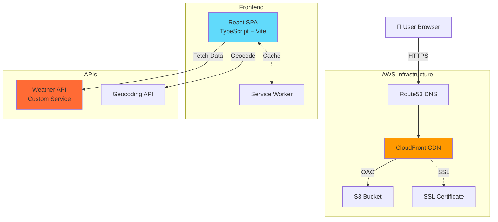
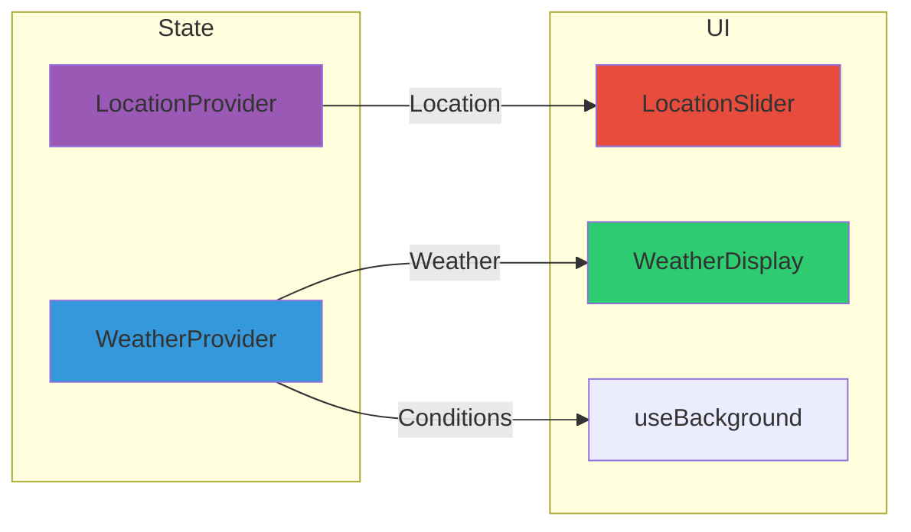

# ☀️ Little Weather

> A beautiful, progressive web app for real-time weather information with dynamic backgrounds that change based on time of day and weather conditions.

[](https://weather.mattlittle.me)
[](https://reactjs.org/)
[](https://www.typescriptlang.org/)
[](https://vitejs.dev/)
[](https://aws.amazon.com/)

---

## ✨ Features

- **Real-time Weather Data** - Current conditions, hourly (24hr), and daily forecasts (8-day)
- **Dynamic Backgrounds** - Automatically adapts to time of day and weather conditions
- **Progressive Web App** - Install on mobile devices for app-like experience
- **Auto-refresh** - Configurable weather updates (default: 5 minutes)
- **Location Search** - Search by city, postal code, or use current location
- **Responsive Design** - Optimized for mobile, tablet, and desktop
- **Offline Support** - Service worker caching for offline functionality
- **Fast & Secure** - CloudFront CDN with HTTPS enforcement

---

## 🏗️ Architecture

### System Overview



### Component Architecture



---

## 🛠️ Tech Stack

**Frontend:** React 18.3, TypeScript 5.5, Vite 5.4, React Bootstrap  
**PWA:** vite-plugin-pwa, Workbox  
**Styling:** Custom CSS, Bootstrap 5, Font Awesome 4.7  
**APIs:** Custom Weather API, Geocoding API  
**Infrastructure:** AWS (S3, CloudFront, Route53, ACM), Terraform  
**Tools:** ESLint, Git

---

## 🚀 Getting Started

### Prerequisites

- Node.js >= 18.0.0
- npm >= 9.0.0
- AWS CLI (for deployment)
- Terraform >= 1.0 (for infrastructure)

### Installation

```bash
# Clone repository
git clone https://github.com/mattlittle16/WeatherWeb.git
cd WeatherWeb

# Install dependencies
npm install

# Set up environment variables
cp .env.example .env.local
# Edit .env.local with your API keys

# Start development server
npm run dev

# Open browser to https://localhost:5173
```

### Environment Variables

Create `.env.local`:

```env
VITE_GEOCODE_API_KEY=your_geocoding_api_key
VITE_WEATHER_API_KEY=your_weather_api_key
VITE_WEATHER_REFRESH_INTERVAL_MS=300000  # 5 minutes
```

---

## 💻 Development

### Available Commands

```bash
npm run dev       # Start dev server (https://localhost:5173)
npm run build     # Create production build
npm run preview   # Preview production build
npm run lint      # Run ESLint
```

### Key Features

- **Hot Module Replacement** - Instant updates without reload
- **TypeScript** - Type safety and autocomplete
- **HTTPS in Dev** - Test PWA features locally
- **React DevTools** - Component inspection

---

## 🚢 Deployment

### One-Time Infrastructure Setup

```bash
cd terraform
terraform init
terraform plan
terraform apply
```

This creates: S3 bucket, CloudFront distribution, SSL certificate, Route53 DNS record

### Deploy Application

```bash
./scripts/deploy.sh
```

The script automatically:
1. Builds the React app
2. Uploads to S3
3. Invalidates CloudFront cache
4. Shows deployment status

**Manual Deployment:**

```bash
npm run build
aws s3 sync dist/ s3://weather-mattlittle-me/ --delete
aws cloudfront create-invalidation --distribution-id YOUR_CF_ID --paths "/*"
```

---

## 📁 Project Structure

```
WeatherWeb/
├── src/
│   ├── components/          # React components
│   ├── shared/              # Context providers
│   ├── hooks/               # Custom hooks
│   ├── models/              # TypeScript interfaces
│   ├── loaders/             # API clients
│   ├── assets/              # Images & backgrounds
│   └── css/                 # Stylesheets
├── terraform/               # Infrastructure as Code
│   └── modules/             # Terraform modules
├── scripts/                 # Deployment scripts
└── public/                  # Static assets & PWA icons
```

---

## 📱 PWA Installation

### iOS (Safari)
1. Open https://weather.mattlittle.me
2. Tap Share → "Add to Home Screen"

### Android (Chrome)
1. Open https://weather.mattlittle.me
2. Tap menu → "Install app"

**Note:** iOS/Safari does not show automatic install prompts. Users must manually add via the Share button.

---

## ⚙️ Configuration

### Terraform Variables

Edit `terraform/terraform.tfvars`:

```hcl
domain_name    = "weather.mattlittle.me"
subdomain      = "weather"
hosted_zone_id = "YOUR_ROUTE53_ZONE_ID"
bucket_name    = "weather-mattlittle-me"
```

### Caching Strategy

| Asset Type | Cache Duration | Notes |
|------------|---------------|-------|
| HTML | No cache | Ensures latest version |
| JS/CSS | 1 year | Vite hash-based versioning |
| Images | 1 year | Static assets |
| API Calls | 5 minutes | Fresh weather data |

---

## 📊 Performance

### Target Lighthouse Scores

| Metric | Score |
|--------|-------|
| 🎯 Performance | 95+ |
| ♿ Accessibility | 100 |
| 🔍 Best Practices | 100 |
| 🔍 SEO | 100 |
| � PWA | ✓ |

---

## 👤 Author

**Matt Little**
- Website: [mattlittle.me](https://mattlittle.me)
- GitHub: [@mattlittle16](https://github.com/mattlittle16)

---

## 🙏 Acknowledgments

- Icons from [Font Awesome](https://fontawesome.com/)
- Hosting on [AWS](https://aws.amazon.com/)
- Built with [React](https://reactjs.org/) and [Vite](https://vitejs.dev/)

---

<div align="center">
  <p>Made with ☀️ and ☁️ by Matt Little</p>
  <p>
    <a href="https://weather.mattlittle.me">View Live Site</a> •
    <a href="https://github.com/mattlittle16/WeatherWeb/issues">Report Bug</a> •
    <a href="https://github.com/mattlittle16/WeatherWeb/issues">Request Feature</a>
  </p>
</div>
